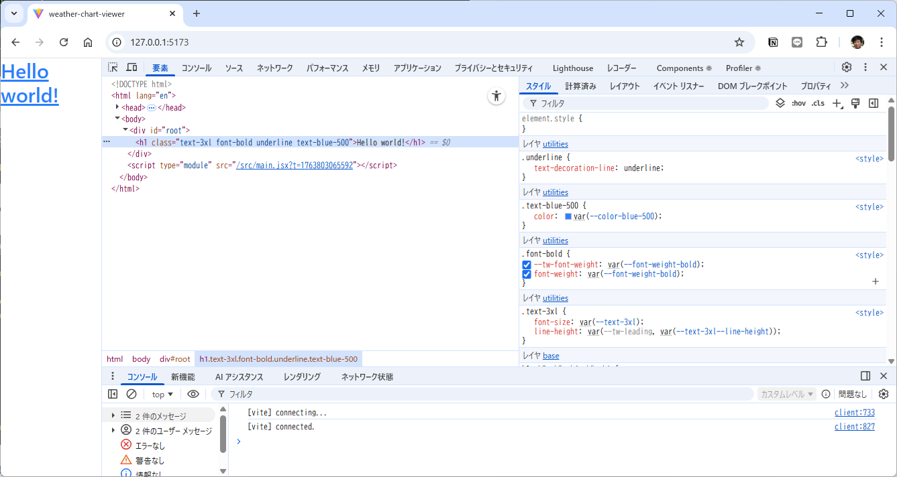

# インストール手順
## プロジェクト作成
### 初期設定
```
node --version
sudo apt-get update
sudo apt-get install -y nodejs npm
```

### プロジェクト生成
```
npm create vite@latest weather-chart-viewer -- --template react
mv weather-chart-viewer/* .
```
## tailwindcss追加
[Tailwind CSS v4 + Viteのセットアップ手順（v3からの変更点も解説）](https://qiita.com/y-keiyu/items/30ccae4bd9a20cd7be9f)
### インストール
```
npm install tailwindcss @tailwindcss/vite
```
### vite.config.ts編集
旧)
```js
import { defineConfig } from 'vite'
import react from '@vitejs/plugin-react'

// https://vite.dev/config/
export default defineConfig({
  plugins: [react()],
})
```
新)
```js
import { defineConfig } from 'vite'
import react from '@vitejs/plugin-react'
import tailwindcss from '@tailwindcss/vite'

// https://vite.dev/config/
export default defineConfig({
  plugins: [
    react(),
    tailwindcss(),
  ],
})
```
### src/index.css編集
新)
```css
@import "tailwindcss";
```
### src/App.css中身削除
新)
```css
```
### src/App.jsx編集
旧)
```jsx
import { useState } from 'react'
import reactLogo from './assets/react.svg'
import viteLogo from '/vite.svg'
import './App.css'

function App() {
  const [count, setCount] = useState(0)

  return (
    <>
      <div>
        <a href="https://vite.dev" target="_blank">
          
        </a>
        <a href="https://react.dev" target="_blank">
          
        </a>
      </div>
      <h1>Vite + React</h1>
      <div className="card">
        <button onClick={() => setCount((count) => count + 1)}>
          count is {count}
        </button>
        <p>
          Edit <code>src/App.jsx</code> and save to test HMR
        </p>
      </div>
      <p className="read-the-docs">
        Click on the Vite and React logos to learn more
      </p>
    </>
  )
}

export default App
```

新)
```jsx
import { useState } from 'react'
import './App.css'

function App() {
  return (
    <>
      <h1 className="text-3xl font-bold underline text-blue-500">
        Hello world!
      </h1>    
    </>
  )
}

export default App
```
### 効果確認
```sh
npm run dev
```


## TanStack Router
[Installation with Vite](https://tanstack.com/router/latest/docs/framework/react/installation/with-vite)
[Vite × React × TanStack Router で始める快適フロント開発環境の構築](https://qiita.com/molpui0726/items/c213a563c0ba58705f72)
### インストール
```
npm install @tanstack/react-router
npm install -D @tanstack/router-plugin @tanstack/router-devtools
```
### vite.config.ts編集
- 手動でRouteを作成するのでなくてよい。

### main.jsx
- 手動でRouteを作成

### src/pages/Home.jsx
- 一旦固定値でページリストをコーディング

### src/pages/Viewer.jsx
- パラメータが引き渡されていることを表示させて確認。

